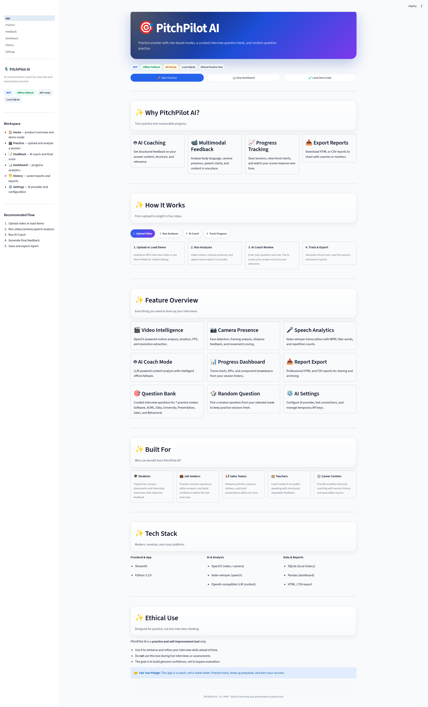
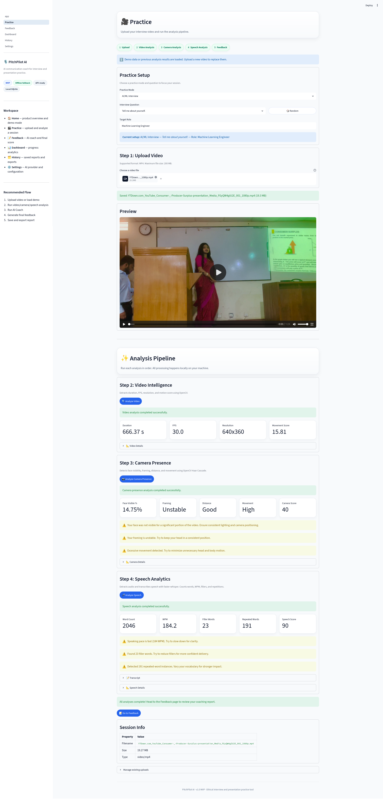
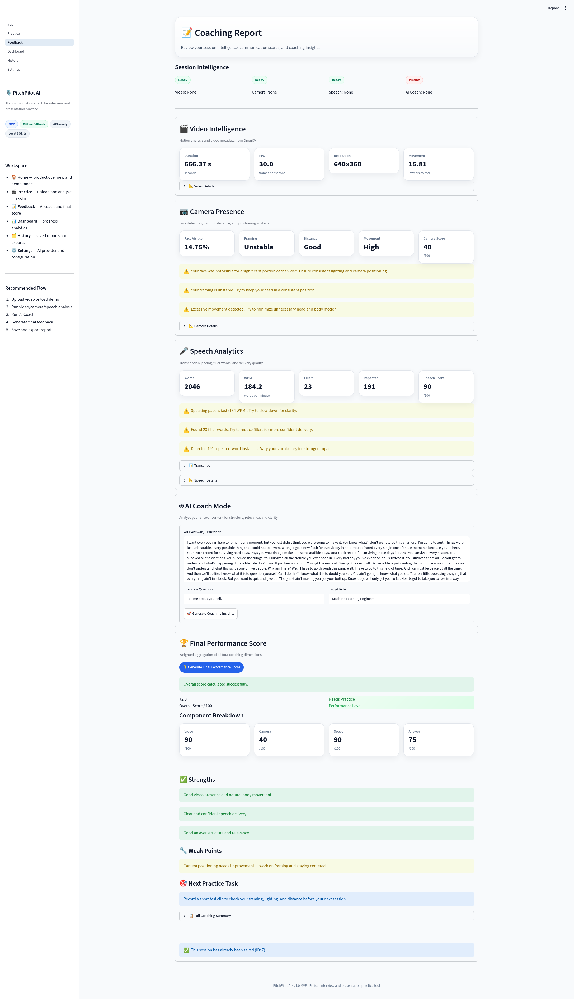
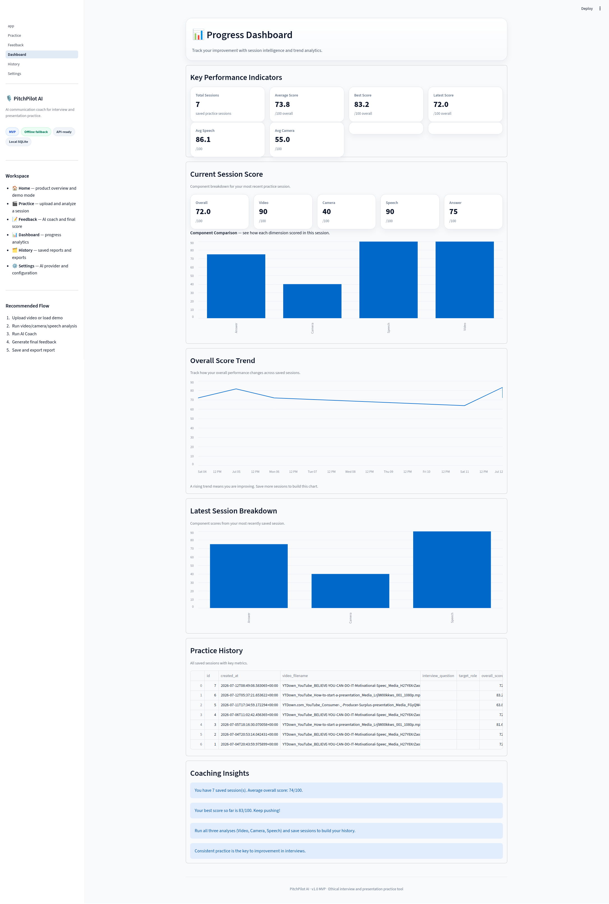
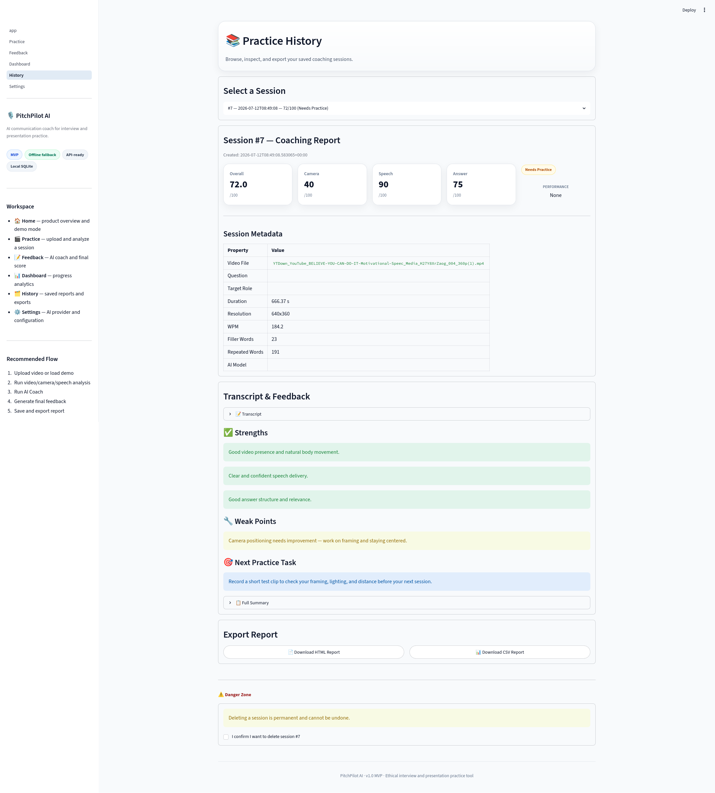
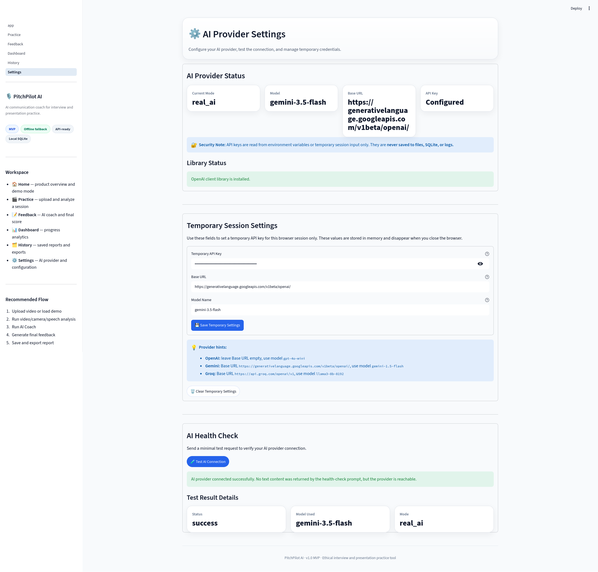
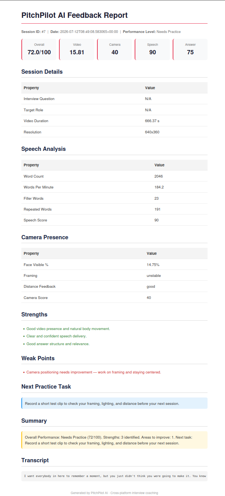

# PitchPilot AI

<p align="center">
  
  
  
  
</p>

**AI Interview & Presentation Coach** — Practice smarter, get structured feedback, and track your improvement over time.

---

## Short Description

PitchPilot AI is an end-to-end coaching platform that analyzes practice interview and presentation videos. It evaluates body movement, camera presence, speech clarity, and answer content — then combines everything into a single overall performance score with actionable next steps.

> **Demo Mode included** — Try the full UI and feature set instantly without uploading a video.

---

## Demo

> **Demo video:** [Coming soon — Loom/YouTube link to be added after recording]
>
> **GitHub Repository:** https://github.com/jahid-cr7/PitchPilot-AI

**Quick preview of what the demo covers:**
- Upload a video on the Practice page (or load Demo Data instantly)
- Run Video, Camera, and Speech analyses
- Review AI Coach feedback — works offline with rule-based fallback, upgrades to LLM with an API key
- Generate a final performance score and save the session
- Track progress on the Dashboard and export HTML/CSV reports

For a full demo script and recording checklist, see [`portfolio/DEMO_VIDEO_CHECKLIST.md`](portfolio/DEMO_VIDEO_CHECKLIST.md).

---

## Startup-Style UI

PitchPilot AI features a polished, SaaS-style interface designed for portfolio demos and company interviews:

- **Gradient hero section** with clear CTAs
- **Step indicators** for the guided practice workflow
- **Styled metric cards** with soft shadows and hover effects
- **Status badges** (MVP, Offline Fallback, API-Ready, Ethical Practice Tool)
- **Professional empty states** with action suggestions
- **Section cards** with borders and consistent spacing
- **Responsive layout** that works on desktop and mobile

The UI uses custom CSS injected safely via Streamlit and follows modern SaaS design patterns.

---

## Key Features

| Feature | Description |
|---------|-------------|
| **Video Analysis** | Extracts duration, FPS, resolution, and movement score using OpenCV |
| **Camera Presence** | Detects face visibility, framing, distance, and movement level |
| **Speech Analysis** | Transcribes audio with faster-whisper, counts filler words, WPM, and repetitions |
| **AI Coach** | Analyzes answer structure, relevance, and clarity — with rule-based fallback when no API key is set |
| **Final Scoring** | Combines all dimensions into a weighted overall score (0–100) with performance level |
| **Dashboard** | Tracks progress over time with trend charts and key metrics |
| **Session History** | Saves completed sessions to SQLite with HTML/CSV export |
| **Demo Mode** | Loads sample data instantly for presentations and testing |
| **Role-Based Question Bank** | Curated interview questions across 7 practice modes (Software Dev, AI/ML, Data Analyst, University, Presentation, Sales, Behavioral) with random question picker |
| **AI Settings** | Configure AI provider, test connections, and manage temporary API keys |
| **User Accounts & JWT Auth** | Email/password registration, bcrypt-hashed passwords, JWT-based sessions, user-scoped history/dashboard/reports (v1.2.0) |

---

## Authentication & User Accounts

Starting in **v1.2.0**, PitchPilot AI ships with a full authentication layer that scopes every practice session, dashboard chart, and exported report to the logged-in user.

### How it works
- **Passwords** are hashed with `bcrypt` before they touch the database. Plaintext passwords are never stored, logged, or persisted anywhere.
- **Tokens** are signed **JWT**s (HS256) issued by the FastAPI backend and verified via a `Depends(get_current_user)` dependency on every protected route.
- **Sessions are user-scoped:** rows in the `sessions` table carry a `user_id` FK, and every `SELECT` filters by the caller's id — User A can never see User B's history, dashboard trend, or reports.
- **Token storage:**
  - React web app → `localStorage` under `pitchpilot_auth_token` / `pitchpilot_auth_user` (managed by `AuthContext`).
  - Expo mobile app → `AsyncStorage` under the same keys.
  - Both clients attach `Authorization: Bearer <token>` on every protected request and clear local state on HTTP 401.

### Public vs. protected endpoints

| Endpoint | Auth required |
|---|---|
| `GET /health`, `GET /` | ❌ Public |
| `POST /auth/register`, `POST /auth/login`, `POST /auth/logout` | ❌ Public |
| `GET /auth/me` | ✅ Requires JWT |
| `GET /api/v1/questions/modes` | ❌ Public |
| `GET /api/v1/questions/{mode}` | ❌ Public |
| `GET /api/v1/questions/{mode}/random` | ❌ Public |
| `GET /api/v1/questions/{mode}/default-role` | ❌ Public |
| `POST /api/v1/analyze/full` | ✅ Requires JWT |
| `GET /api/v1/sessions`, `GET /api/v1/sessions/{id}`, `DELETE /api/v1/sessions/{id}` | ✅ Requires JWT |
| `GET /api/v1/dashboard/stats` | ✅ Requires JWT |
| `GET /api/v1/reports/{session_id}/html`, `GET /api/v1/reports/{session_id}/csv` | ✅ Requires JWT |

### Required environment variables
```bash
# Generate with:
#   python -c "import secrets; print(secrets.token_urlsafe(64))"
PITCHPILOT_JWT_SECRET=replace_me_with_a_long_random_string
PITCHPILOT_JWT_EXPIRES_MINUTES=1440
```

If `PITCHPILOT_JWT_SECRET` is left as the default insecure value in `production`, the API refuses to start with a clear error. See [`docs/DEPLOYMENT_WEB_API.md`](docs/DEPLOYMENT_WEB_API.md#authentication-jwt) for the full deployment checklist and [`docs/AUTH_QA_CHECKLIST.md`](docs/AUTH_QA_CHECKLIST.md) for the end-to-end QA script.

---

## Screenshots

Below are screenshots from the v1.0.0 release showing the full practice, coaching, dashboard, history, settings, and export workflow.

### Home Page


### Practice Mode & Question Bank


### AI Coaching Feedback


### Progress Dashboard


### Session History & Export


### AI Provider Settings


### Exported HTML Report


---

## Mobile App Preview

PitchPilot AI includes a premium dark-themed **Expo mobile app** for iOS and Android. It shares the same FastAPI backend and SQLite database as the web and desktop clients.

### Mobile Screenshots

> Screenshots are captured from the Expo web preview at iPhone 14 Pro viewport (390×844).
> See [`portfolio/MOBILE_SCREENSHOT_CHECKLIST.md`](portfolio/MOBILE_SCREENSHOT_CHECKLIST.md) for the capture guide.

#### Home

*Screenshot pending — capture after backend is connected and hero is visible.*

#### Practice Lab

*Screenshot pending — capture with file selected and "Run Analysis" enabled.*

#### Feedback Score

*Screenshot pending — capture after a successful analysis so real score data appears.*

#### Settings

*Screenshot pending — capture with backend status showing "Connected".*

### Mobile Features

- **Home** — Premium hero landing with backend status, core module cards, latest session snapshot, and quick stats
- **Practice Lab** — Segmented control (Solo Practice / AI Interview with "Coming Soon" badge), mode selection, random question picker, video upload with file metadata, and full AI analysis pipeline
- **Feedback** — Animated score ring, Coach Aria avatar card, dimension scores, strengths, growth areas, improved answer, next milestone, and real export/share via native share sheet
- **Settings** — Backend URL configuration with platform-specific help, connection test, AI provider cards, and persisted preference toggles (Save Practice History, Speech Analysis)
- **History & Dashboard** — Accessible from Settings or Feedback; glass-card session list with detail view, progress bars, and report export

### Run the Mobile App

```bash
cd mobile
npm install
npx expo start -c --web     # web preview (fastest)
npx expo start -c --lan     # native device via Expo Go
```

See [`mobile/README.md`](mobile/README.md) for detailed backend URL setup, emulator instructions, and troubleshooting.

---

## Multi-Platform Architecture

PitchPilot AI now runs across four surfaces powered by a single shared backend:

| Surface | Purpose | Stack |
|---------|---------|-------|
| **Streamlit App** | Desktop demo and quick testing | Python, Streamlit |
| **FastAPI Backend** | Shared REST API for all clients | Python, FastAPI, SQLite |
| **React Web Frontend** | Premium dark SaaS web experience | React 18, Vite, Tailwind CSS, Recharts |
| **Expo Mobile App** | iOS and Android practice on the go | Expo SDK 57, React Native, TypeScript |

All four clients consume the same core analyzers (`core/`) and save sessions to the same SQLite database via the FastAPI backend.

---

## Tech Stack

| Layer | Technology |
|-------|------------|
| **Desktop Demo** | Streamlit, Python 3.12+ |
| **Web Frontend** | React 18, Vite, Tailwind CSS, Recharts, Framer Motion |
| **Mobile App** | Expo SDK 57, React Native 0.86, TypeScript |
| **Backend API** | FastAPI, Uvicorn, Pydantic |
| **Video / Camera** | OpenCV (Haar Cascade face detection, optical flow) |
| **Speech** | faster-whisper (ONNX runtime) |
| **AI Analysis** | OpenAI-compatible LLM API (GPT-4o-mini by default) |
| **Data** | SQLite (local session storage) |
| **Dashboard** | Pandas, Streamlit native charts / Recharts (React) |
| **Reports** | HTML / CSV export generators |
| **DevOps** | Docker, Docker Compose, GitHub Actions CI |

---

## Architecture Overview

```
┌─────────────────┐  ┌─────────────────┐  ┌─────────────────┐
│   Streamlit     │  │  React Web      │  │  Expo Mobile    │
│   (Desktop)     │  │  (Browser)      │  │  (iOS/Android)  │
│                 │  │                 │  │                 │
│  ┌──────────┐   │  │  ┌──────────┐   │  │  ┌──────────┐   │
│  │ Practice │   │  │  │ Practice │   │  │  │ Practice │   │
│  │ Feedback │   │  │  │ Feedback │   │  │  │ Feedback │   │
│  │ Dashboard│   │  │  │ Dashboard│   │  │  │ Dashboard│   │
│  │ History  │   │  │  │ History  │   │  │  │ History  │   │
│  └────┬─────┘   │  │  └────┬─────┘   │  │  └────┬─────┘   │
└───────┼─────────┘  └───────┼─────────┘  └───────┼─────────┘
        │                    │                    │
        └────────────────────┼────────────────────┘
                             │
              ┌──────────────▼──────────────┐
              │      FastAPI Backend        │
              │  /api/v1/analyze/full       │
              │  /api/v1/sessions           │
              │  /api/v1/dashboard/stats    │
              │  /api/v1/reports/{id}/html  │
              └──────────────┬──────────────┘
                             │
        ┌────────────────────┼────────────────────┐
        │                    │                    │
  ┌─────▼─────┐       ┌─────▼─────┐       ┌──────▼──────┐
  │  OpenCV   │       │ faster-   │       │ OpenAI API  │
  │ Video/Cam │       │ whisper   │       │ (optional)  │
  └───────────┘       └───────────┘       └─────────────┘
                             │
                        ┌────▼────┐
                        │ SQLite  │
                        │ History │
                        └─────────┘
```

For a detailed breakdown, see [docs/ARCHITECTURE.md](docs/ARCHITECTURE.md).

---

## How It Works

1. **Upload** an MP4 video on the **Practice** page.
2. **Run analyses** — Video (motion), Camera (face presence), Speech (transcription).
3. **Review feedback** on the **Feedback** page with per-dimension metrics.
4. **Run AI Coach** — Enter the interview question and target role. The AI evaluates your transcript for structure, relevance, and clarity.
5. **Generate final score** — Combines all scores into an overall rating with strengths, weak points, and a next practice task.
6. **Save session** — Stores everything in SQLite for history and trend tracking.
7. **Export** — Download HTML or CSV reports from the **History** page.

---

## Installation & Running

### 1. Backend (Required for React + Mobile)

```bash
cd ~/PitchPilot\ AI
source .venv/bin/activate
pip install -r requirements.txt
python -m uvicorn api.main:app --host 0.0.0.0 --port 8000 --reload
```

The API will be available at `http://127.0.0.1:8000`.

> **Note:** Use `--host 0.0.0.0` so physical phones on the same Wi-Fi can reach it.

### 2. Streamlit Desktop App

```bash
cd ~/PitchPilot\ AI
source .venv/bin/activate
streamlit run app.py
```

Opens at `http://localhost:8501`.

### 3. React Web Frontend

```bash
cd frontend
npm install
npm run dev
```

Opens at `http://localhost:5173`.

### 4. Expo Mobile App

```bash
cd mobile
npm install
npx expo start -c --lan
```

Scan the QR code with your phone or open in a simulator.

#### Mobile Backend URL Setup

| Platform | Backend URL |
|----------|-------------|
| Local browser / iOS simulator | `http://127.0.0.1:8000` |
| Android emulator | `http://10.0.2.2:8000` |
| Physical phone (same Wi-Fi) | `http://<YOUR_LAPTOP_IP>:8000` |

> See [mobile/README.md](mobile/README.md) for detailed connection instructions.

---

## Production Deployment (Web + API)

PitchPilot AI ships with a production-ready Docker Compose setup for the FastAPI backend and React frontend.

```bash
# 1. Copy production environment template
cp .env.production.example .env

# 2. Edit .env with your real AI key and CORS origins
nano .env

# 3. Build and start both services
docker compose -f docker-compose.prod.yml up --build -d
```

| Service | URL |
|---------|-----|
| API | `http://localhost:8000` |
| Web | `http://localhost:3000` |

See [docs/DEPLOYMENT_WEB_API.md](docs/DEPLOYMENT_WEB_API.md) for full details on environment variables, CORS, upload limits, SQLite volumes, and troubleshooting.

---

## Deployment

### Streamlit Cloud / Production

- See [DEPLOYMENT.md](DEPLOYMENT.md) for full deployment instructions.
- Configure secrets using your deployment platform's secrets manager.
- **Never commit real API keys to Git.**

### Docker

Docker and Docker Compose are supported.

- **Streamlit app:** `docker-compose up --build` (see [docs/DOCKER.md](docs/DOCKER.md))
- **Web + API production:** `docker compose -f docker-compose.prod.yml up --build -d` (see [docs/DEPLOYMENT_WEB_API.md](docs/DEPLOYMENT_WEB_API.md))

### CI

GitHub Actions CI is configured to compile-check the code and run smoke tests on every push and pull request.

---

## How to Use Demo Mode

Perfect for interviews, presentations, or testing without a real video:

1. Open the app and go to the **Home** page.
2. Click **"🚀 Load Demo Data"**.
3. Navigate to **Feedback** to see sample analysis results.
4. Explore the **Dashboard** for trend charts.
5. Visit **History** to view how sessions are stored and exported.

---

## How to Use a Real AI API Key

The AI Coach works out of the box in **fallback (rule-based) mode**. To enable real AI-powered analysis:

1. Obtain an API key from OpenAI or any OpenAI-compatible provider.
2. Set the environment variable before running the app:

```bash
export PITCHPILOT_AI_API_KEY="sk-..."
export PITCHPILOT_AI_MODEL="gpt-4o-mini"   # optional
export PITCHPILOT_AI_BASE_URL=""            # optional, for custom providers
```

3. Restart the app. The AI Coach will now call the LLM API instead of using rule-based scoring.

---

## Project Structure

```
PitchPilot AI/
├── app.py                      # Streamlit landing page with Demo Mode
├── core/                       # Shared analyzers (used by all clients)
│   ├── video_analyzer.py       # OpenCV video metadata & motion analysis
│   ├── camera_analyzer.py      # OpenCV face detection & presence scoring
│   ├── speech_analyzer.py      # faster-whisper transcription & speech metrics
│   ├── ai_coach_agent.py       # LLM integration + rule-based fallback
│   ├── scoring_engine.py       # Weighted overall score calculation
│   ├── database.py             # SQLite session storage
│   ├── ui_utils.py             # Shared sidebar & UI components
│   └── question_bank.py        # Role-based interview question bank
├── api/                        # FastAPI backend
│   ├── main.py                 # FastAPI app with all REST endpoints
│   ├── config.py               # Production settings from environment variables
│   ├── services.py             # Service wrappers around core analyzers
│   ├── schemas.py              # Pydantic request/response models
│   └── README.md               # API documentation
├── frontend/                   # React web frontend
│   ├── src/
│   │   ├── api/                # Fetch wrapper around FastAPI
│   │   ├── components/         # Reusable UI components
│   │   ├── pages/              # Home, Practice, Feedback, Dashboard, History, Settings
│   │   └── types/              # TypeScript interfaces
│   ├── Dockerfile              # Production nginx container
│   ├── nginx.conf              # Static server + SPA fallback
│   └── README.md
├── mobile/                     # Expo React Native app
│   ├── src/
│   │   ├── api/                # API client
│   │   ├── app/                # File-based routes (Expo Router)
│   │   ├── components/         # Shared UI components
│   │   └── theme/              # Colors, spacing, typography
│   └── README.md
├── pages/                      # Streamlit multipage app
│   ├── 1_Practice.py
│   ├── 2_Feedback.py
│   ├── 3_Dashboard.py
│   ├── 4_History.py
│   └── 5_Settings.py
├── reports/
│   └── report_generator.py     # HTML & CSV report generators
├── docs/                       # Documentation
│   ├── ARCHITECTURE.md
│   ├── MULTIPLATFORM_QA_CHECKLIST.md
│   ├── QA_CHECKLIST.md
│   ├── DEMO_SCRIPT.md
│   ├── INTERVIEW_GUIDE.md
│   ├── ROADMAP.md
│   └── ...
├── portfolio/                  # Portfolio demo package
│   ├── PROJECT_SUMMARY.md
│   ├── INTERVIEW_PITCH.md
│   ├── DEMO_FLOW.md
│   └── ...
├── uploads/                    # Uploaded MP4 files (gitignored)
├── data/                       # SQLite database (gitignored)
├── requirements.txt
├── Dockerfile.api              # FastAPI production container
├── docker-compose.prod.yml     # Production orchestration (API + Web)
├── .env.production.example     # Production environment template
├── README.md
├── CHANGELOG.md
├── RELEASE_NOTES.md
├── DEPLOYMENT.md
└── .gitignore
```

---

## Quality Check

Before pushing to GitHub, recording a demo, or presenting in an interview, run the automated smoke test:

```bash
python scripts/smoke_test.py
```

This script verifies:
- Required files and folders exist
- All core modules import successfully
- SQLite database initializes correctly
- AI Coach fallback mode works without an API key
- AI connection test returns gracefully
- Scoring engine computes a valid overall score
- Report generator produces non-empty HTML and CSV output

For a full manual checklist, see [docs/QA_CHECKLIST.md](docs/QA_CHECKLIST.md).

---

## Ethical Use Note

PitchPilot AI is designed as a **practice and self-improvement tool only**.

- Use it to rehearse and refine your skills ahead of time.
- Do **not** use this tool during live interviews or assessments.
- The goal is to build genuine confidence, not to bypass evaluation.

---

## Current Limitations

- Speech analysis requires a local faster-whisper model download on first run (~150 MB).
- Camera analysis uses Haar Cascade (fast but less accurate than deep-learning detectors).
- AI Coach requires an external API key for LLM-powered analysis; otherwise uses rule-based fallback.
- No user authentication or multi-user support in the MVP.
- Video analysis is limited to MP4 format.

---

## Future Improvements

See [docs/ROADMAP.md](docs/ROADMAP.md) for the full roadmap. Highlights:

- Enhanced speech analytics (sentiment, emotion, pause analysis, multi-language)
- Deep-learning body language analysis (MediaPipe, BlazePose)
- User accounts and authentication
- Real-time practice mode (live webcam + microphone feedback)
- Team dashboard for coaching organizations
- Cloud sync and backup beyond local SQLite

---

## Interview Talking Points

**If you have 30 seconds:**
> "PitchPilot AI is a Python/Streamlit app that analyzes practice interview videos. It evaluates body language, camera presence, speech clarity, and answer content — then gives you a score and actionable feedback. It works offline for most features and has a demo mode for quick testing."

**If you have 2 minutes:**
> "I built PitchPilot AI as an MVP to solve a real problem: people struggle to get objective feedback on their interview performance. The app takes an MP4 video, runs OpenCV for motion and face detection, faster-whisper for transcription, and an LLM for content analysis. If no API key is available, it gracefully falls back to rule-based scoring. Everything is stored in SQLite so users can track progress over time. The architecture is modular — each analyzer is independent, so I can swap in better models later without rewriting the UI."

---

## Portfolio & Demo

PitchPilot AI includes a complete **portfolio demo package** designed for GitHub showcases, company interviews, and career presentations:

| Document | Purpose |
|----------|---------|
| [`portfolio/PROJECT_SUMMARY.md`](portfolio/PROJECT_SUMMARY.md) | One-page project overview with problem, users, features, tech stack, and ethical use note |
| [`portfolio/INTERVIEW_PITCH.md`](portfolio/INTERVIEW_PITCH.md) | Ready-to-use pitch scripts: 30s, 1m, 2m, technical, and business explanations |
| [`portfolio/DEMO_FLOW.md`](portfolio/DEMO_FLOW.md) | Step-by-step demo walkthrough with talking points for every screen |
| [`portfolio/RESUME_BULLETS.md`](portfolio/RESUME_BULLETS.md) | CV bullet points, LinkedIn descriptions, GitHub repo description, and portfolio website copy |
| [`portfolio/SCREENSHOT_LIST.md`](portfolio/SCREENSHOT_LIST.md) | Required screenshot checklist with capture instructions and naming conventions |

Use these documents to prepare for interviews, update your portfolio, or record a demo video.

---

## License

MIT License — feel free to use, modify, and distribute.

---

<p align="center">
  Built with ❤️ for job seekers and public speakers everywhere.
</p>
